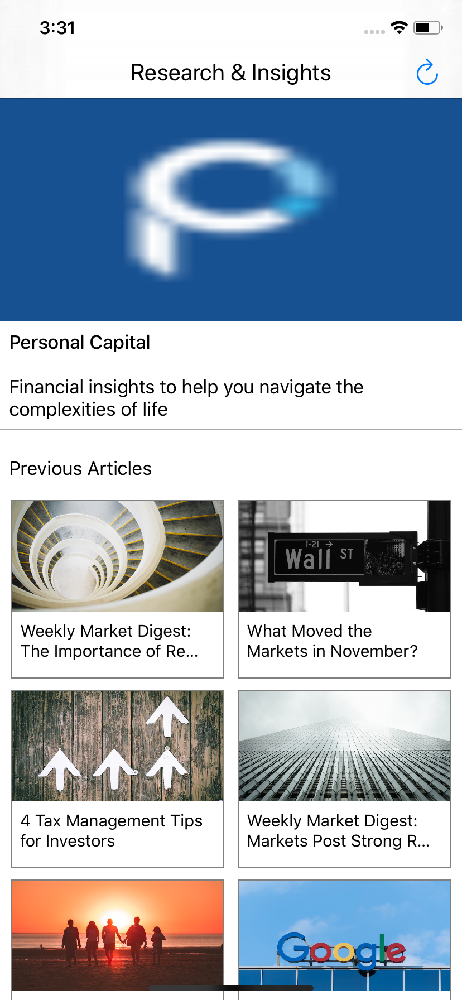
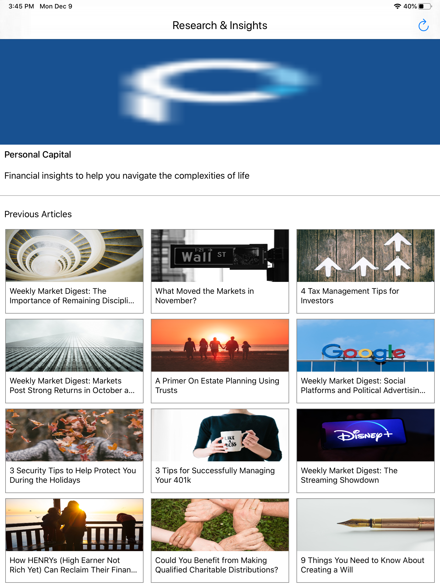

# PersonalCapitalBlog

BlogCollectionViewController is root CollectionView Controller

BlogCollectionViewCell is subcalss of UICollectionViewCell

RSS feed XML is parsed into class BlogResponse

BlogContentViewController blog link shown

iPhone Output

iPad Output

